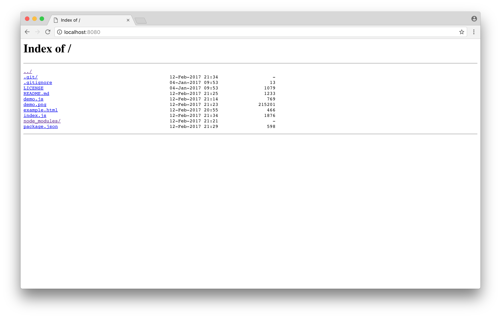

# directory-index-html

Make an plain html page containing a directory listing.
Similar in look and feel to NGINX's listing page.

```
npm install directory-index-html
```

## Usage

``` js
var toHTML = require('directory-index-html')

var entries = [{
  name: 'test',
  size: 24424,
  mtime: new Date()
}, {
  name: 'a-dir/',
  mtime: new Date()
}]

console.log(toHTML('/foo/bar', entries))
```

## API

#### `var html = toHTML(dir, entries)`

Render a directory name and listing to an plain HTML string.

`dir` should be a string containing the directory name.

`entries` should be an array of entries that are similar to this

``` js
{
  name: 'name-of-file-or-dir',
  size: 42424, // size in bytes
  mtime: new Date() // when was this modified
}
```

To figure out if an entry is a directory the module will one of the following things:

* Check if the path ends with a `/`
* See if `entry.type === 'directory'`
* See if `entry.mode` specifies a directory

## Demo

There is a small demo server bundled in the repo that serves a directory listing of your
current working directory.

To try it out, run `node demo.js` and visit `http://localhost:8080`.

It should show something like this:



## License

MIT
